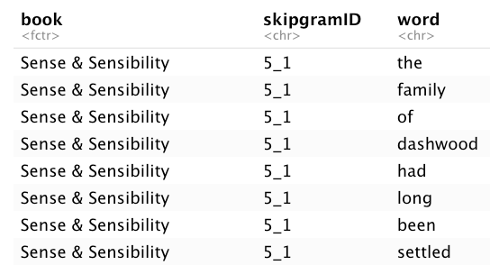

<https://juliasilge.com/blog/tidy-word-vectors/> for skipgram idea <https://juliasilge.com/blog/word-vectors-take-two/> for glove idea <https://juliasilge.github.io/why-r-webinar/#81> <https://www.r-bloggers.com/2020/08/whats-the-difference-between-instagram-and-tiktok-using-word-embeddings-to-find-out-2/>

```{r setup, include=FALSE}
knitr::opts_chunk$set(echo = TRUE)
```

# Julia's v

```{r}
library(tidyverse)
library(tidytext)
library(janeaustenr)

austen_text <- austen_books() %>%
    mutate(text = na_if(text, "")) %>%
    drop_na(text) %>%
    mutate(postID = row_number())
```

```{r unigram-prob}
library(tidytext)

unigram_probs <- austen_text %>%
    unnest_tokens(word, text) %>%
    count(word, sort = TRUE) %>%
    mutate(p = n / sum(n))

```

```{r skipgram}
library(widyr)

tidy_skipgrams <- austen_text %>%
    unnest_tokens(ngram, text, token = "ngrams", n = 8) %>%
    drop_na(ngram) %>%
    mutate(ngramID = row_number()) %>%
    unite(skipgramID, postID, ngramID) %>% 
    unnest_tokens(word, ngram)

tidy_skipgrams
```

```{r skipgram-probs}
skipgram_probs <- tidy_skipgrams %>%
    pairwise_count(word, skipgramID, diag = TRUE, sort = TRUE) %>%
    mutate(p = n / sum(n))
```

```{r normalized-skip-gram-probs}
normalized_prob <- skipgram_probs %>%
    filter(n > 20) %>%
    rename(word1 = item1, word2 = item2) %>%
    left_join(unigram_probs %>%
                  select(word1 = word, p1 = p),
              by = "word1") %>%
    left_join(unigram_probs %>%
                  select(word2 = word, p2 = p),
              by = "word2") %>%
    mutate(p_together = p / p1 / p2)

```

```{r}
normalized_prob %>% 
    filter(word1 == "father") %>%
    arrange(-p_together)
```

```{r cast-sparse}
pmi_matrix <- normalized_prob %>%
    mutate(pmi = log10(p_together)) %>%
    cast_sparse(word1, word2, pmi)

```

```{r Dim-Reduce}
library(irlba)
pmi_svd <- irlba(pmi_matrix, 256, maxit = 1e3)
```

```{r Retrieve-Converting-Matrix}
word_vectors <- pmi_svd$u
# rownames(pmi_matrix)
rownames(word_vectors) <- rownames(pmi_matrix)
```

```{r search-func}
library(broom)

search_synonyms <- function(word_vectors, selected_vector) {
    
    # similarities <- word_vectors %*% selected_vector %>%
    #     tidy() %>%
    #     as_tibble() %>%
    #     rename(token = .rownames,
    #            similarity = unrowname.x.)
    similarities <- word_vectors %*% selected_vector %>% 
        as.data.frame() %>%
        rownames_to_column(var = "token") %>%
        rename(similarity = V1)
    
    similarities %>%
        arrange(-similarity)    
}
```

```{r search-synonyms}
search_synonyms(word_vectors, word_vectors["father",]) %>%
    slice(1:20)
# word_vectors["father",]
```

# Chinese

```{r loading-data}
load("data/s3_watched.rda")
Sys.setlocale(locale="UTF-8")
docs <- s3.watched %>%
    select(doc_id, ptitle, sentence) %>%
    filter(str_detect(sentence, "隊友")) %>%
    mutate(sentence = na_if(sentence, "")) %>%
    drop_na(sentence) %>%
    mutate(postID = row_number())
```

```{r initial-jieba}
library(jiebaR)
stopWords <- readRDS("data/stopWords.rds")
segment_not <- c("爸爸", "爸媽", "新手", "吸乳器")
watched <- c("爸爸","父親","老公","先生","丈夫","奶爸","寶爸","隊友",
             "爹地","爸比","把拔","把鼻","老爸","另一半","拔拔",
             "孩子的爸","孩子爸", "爸拔","他爸","她爸","新手爸","版爸",
             "板爸","我家男人","當爸的","腦公","阿爸","人父","孩子的爹",
             "孩子爹","老爹","外子","拔比","爸鼻","爸把","爸逼","爸咪",
             "把爸","拔爸","爹低","帥爸","準爸","小孩爸","親爸","神爸",
             "宅爸","瓶餵爸","寶寶的爸","孩的爸","女兒的爸")

reserved <- c("神隊友", "豬隊友", "好隊友", "好先生", "好爸爸", "好老公")

watched <- c(watched, reserved)

watched.str <- paste0(watched, collapse = "|")


reserved <- c("神隊友", "豬隊友", "好隊友", "好先生", "好爸爸", "好老公")

cutter <- worker()
tagger <- worker("tag")
new_user_word(cutter, segment_not)
new_user_word(cutter, watched)
new_user_word(tagger, segment_not) %>% invisible()
new_user_word(tagger, watched) %>% invisible()
```

```{r unigram-prob}
library(tidytext)

unigram_probs <- docs %>%
    mutate(word = purrr::map(sentence, function(x)segment(x, cutter))) %>%
    unnest(word) %>%
    count(word, sort = TRUE) %>%
    mutate(p = n / sum(n))

```

<https://alvinntnu.github.io/NTNU_ENC2036_LECTURES/chinese-text-processing.html#>

```{r tokenizer_ngrams}
library(quanteda)

# tokenizer_ngrams_1 <-
#   function(texts, jiebar, n = 2 , skip = 0, delimiter = "_") {
#     texts %>% ## chunks-based char vector
#       segment(jiebar) %>% ## word tokenization 
#       as.tokens %>% ## list to tokens
#       quanteda::tokens_ngrams(n, skip, concatenator = delimiter) %>%  ## ngram tokenization
#       as.list ## tokens to list
#   }

tokenizer_ngrams <-
  function(texts, jiebar, n = 2 , skip = 0, delimiter = "_") {
    texts %>% 
      segment(jiebar) %>% list() %>% as.tokens() %>%
      tokens_ngrams(n, skip, concatenator = delimiter) %>%  ## ngram tokenization
      as.list ## tokens to list
}


```

{width="368"}

```{r skip-gram-prob}
# docs %>% slice(1:10) %>%
#     mutate(ngram = purrr::map(sentence, function(x){tokenizer_ngrams(x, cutter, n=8)})) %>%
#     unnest(ngram) %>% unnest(ngram) %>% View


tidy_skipgrams <- docs %>%
    mutate(ngram = purrr::map(sentence, function(x){tokenizer_ngrams(x, cutter, n=5)})) %>%
    unnest(ngram) %>% unnest(ngram) %>%
    mutate(ngramID = row_number()) %>%
    unite(skipgramID, doc_id, ngramID) %>%
    mutate(word = str_split(ngram, "_")) %>%
    unnest(word) %>%
    select(skipgramID, ptitle, word)

tidy_skipgrams
```

```{r skipgram-probs}
skipgram_probs <- tidy_skipgrams %>%
    pairwise_count(word, skipgramID, diag = TRUE, sort = TRUE) %>%
    mutate(p = n / sum(n))
```

```{r normalized-skip-gram-probs}
normalized_prob <- skipgram_probs %>%
    filter(n > 20) %>%
    rename(word1 = item1, word2 = item2) %>%
    left_join(unigram_probs %>%
                  select(word1 = word, p1 = p),
              by = "word1") %>%
    left_join(unigram_probs %>%
                  select(word2 = word, p2 = p),
              by = "word2") %>%
    mutate(p_together = p / p1 / p2)

```

```{r testing-of-collocation}
normalized_prob %>% 
    filter(word1 == "隊友") %>%
    arrange(-p_together)
```

```{r cast-sparse}
pmi_matrix <- normalized_prob %>%
    mutate(pmi = log10(p_together)) %>%
    filter(word1 != word2) %>%
    cast_sparse(word1, word2, pmi)

```

```{r Dim-Reduce}
library(irlba)
pmi_svd <- irlba(pmi_matrix, 256, maxit = 1e3)
word_vectors <- pmi_svd$u
# rownames(pmi_matrix)
rownames(word_vectors) <- rownames(pmi_matrix)
```

```{r search-func}
library(broom)

search_synonyms <- function(word_vectors, selected_vector) {
    
    # similarities <- word_vectors %*% selected_vector %>%
    #     tidy() %>%
    #     as_tibble() %>%
    #     rename(token = .rownames,
    #            similarity = unrowname.x.)
    similarities <- word_vectors %*% selected_vector %>% 
        as.data.frame() %>%
        rownames_to_column(var = "token") %>%
        rename(similarity = V1)
    
    similarities %>%
        arrange(-similarity)    
}
```

```{r search-synonyms}
search_synonyms(word_vectors, word_vectors["隊友",]) %>% slice(1:20)
# word_vectors["father",]
```


